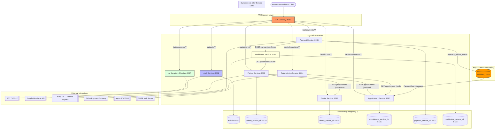

# Backend Architecture Documentation

> **Healthcare Platform — Telemedicine System**
>
> This document is the authoritative reference for the backend architecture of the healthcare platform. It is intended for current and future developers, DevOps engineers, and system architects.

---

## Table of Contents

1. [High-Level Architecture Overview](#1-high-level-architecture-overview)
2. [Key Services and Modules](#2-key-services-and-modules)
3. [Database Design and Integration](#3-database-design-and-integration)
4. [API Structure and Endpoints](#4-api-structure-and-endpoints)
5. [Middleware and Libraries](#5-middleware-and-libraries)
6. [Deployment and Containerization](#6-deployment-and-containerization)
7. [Security Considerations](#7-security-considerations)
8. [Scalability and Performance](#8-scalability-and-performance)
9. [Shared Packages and Reusable Components](#9-shared-packages-and-reusable-components)

---

## 1. High-Level Architecture Overview

The backend is built as a **microservices architecture** using Spring Boot. All client traffic enters through a single **API Gateway** that handles JWT authentication and proxies requests to the appropriate downstream service. Services communicate via synchronous HTTP calls (REST) and asynchronous messaging (RabbitMQ).

### 1.1 Architecture Diagram



### 1.2 Request Flow

1. The React frontend sends an HTTP request with a `Bearer <JWT>` token in the `Authorization` header.
2. The **API Gateway** validates the JWT signature and expiry.
3. On success the gateway forwards the request to the target service, injecting two headers:
   - `X-User-Id` — the JWT subject (username)
   - `X-User-Role` — the first authority claim (e.g. `PATIENT`, `DOCTOR`, `ADMIN`)
4. The downstream service uses these headers for authorization instead of re-validating the token.
5. Responses are forwarded back to the client through the gateway.

---

## 2. Key Services and Modules

### 2.1 Service Inventory

| Service | Port | Package Root | Responsibility |
|---------|------|-------------|----------------|
| **API Gateway** | 8080 | `com.se73.api_gateway` | Single entry point; JWT validation; request routing and proxying |
| **Auth Service** | 8081 | `com.se73.auth_service` | User registration, login, token issuance, user account management |
| **Patient Service** | 8082 | `com.se73.patient_service` | Patient profiles, medical report uploads (AWS S3), appointment and prescription aggregation |
| **Doctor Service** | 8083 | `com.se73.doctor_service` | Doctor profiles, availability slot management, prescription issuance, patient record viewing |
| **Telemedicine Service** | 8084 | `com.se73.telemedicine_service` | Video session lifecycle, Agora token generation, session state management |
| **Appointment Service** | 8085 | `com.SE73.appointment_service` | Appointment booking, status transitions, payment-status tracking |
| **Payment Service** | 8086 | `com.se73.payment_service` | Stripe payment intent creation, webhook handling, transaction records |
| **AI Symptom Checker** | 8087 | `com.se73.ai_symptom_checker` | Symptom analysis via Google Gemini AI |
| **Notification Service** | 8088 | `com.se73.notification_service` | Multi-channel notifications (email, SMS, push, in-app), delivery tracking, audit logging |

> **Note:** The appointment-service root package uses uppercase `SE73` (`com.SE73.appointment_service`) while all other services use lowercase `com.se73`.

### 2.2 API Gateway

**Location:** `backend/api-gateway/`

The gateway is a Spring Boot MVC application using **Spring Cloud Gateway (server-webmvc)**. It is the sole component exposed to the outside world.

Key modules:

| Module | Class | Purpose |
|--------|-------|---------|
| JWT Filter | `JwtAuthenticationFilter` | Servlet filter — validates Bearer token; injects `X-User-Id` / `X-User-Role` headers |
| JWT Provider | `JwtTokenProvider` | Wraps jjwt 0.12.3; validates, parses, and signs HS512 tokens |
| Proxy Controllers | `*ProxyController` | One controller per downstream service; forwards HTTP calls via `RestTemplate` |
| Security Config | `SecurityConfig` | Permits `/api/auth/**`, `/actuator/**`, and `/health`; requires auth for all other paths |

Proxy controllers available: `AppointmentProxyController`, `DoctorAvailabilityProxyController`, `DoctorProfileProxyController`, `PatientProxyController`, `PrescriptionProxyController`, `ProxyController`, `SymptomProxyController`, `TelemedicineProxyController`.

### 2.3 Auth Service

**Location:** `backend/auth-service/`

Provides user account management backed by its own PostgreSQL database.

Key modules:

| Module | Purpose |
|--------|---------|
| `AuthController` | `POST /api/auth/register`, `POST /api/auth/login`, `GET /api/auth/validate`, `GET /api/auth/user/{username}` |
| `JwtTokenProvider` | Issues and validates HS512 JWT tokens (jjwt 0.12.3) |
| `User` (entity) | `id`, `username`, `email`, `password` (BCrypt), `firstName`, `lastName`, `role`, `enabled` |
| `UserRole` (enum) | `PATIENT`, `DOCTOR`, `ADMIN` |

### 2.4 Patient Service

**Location:** `backend/patient-service/`

Manages patient profiles and medical reports. Integrates with other services to fetch appointments and prescriptions.

Key modules:

| Module | Purpose |
|--------|---------|
| Patient Profile CRUD | `PatientProfile` entity stored in `patient_profiles` table |
| Medical Reports | Upload/download reports to/from **AWS S3** bucket (`patient-reports-damith-001`, region `eu-north-1`) |
| Appointment Client | REST call to Appointment Service via `APPOINTMENT_SERVICE_BASE_URL` |
| Prescription Client | REST call to Doctor Service via `PRESCRIPTION_SERVICE_BASE_URL` |

### 2.5 Doctor Service

**Location:** `backend/doctor-service/`

Manages doctor profiles, availability, and clinical records.

Key modules:

| Module | Purpose |
|--------|---------|
| `DoctorProfileController` | CRUD for doctor profiles; admin verification |
| `DoctorAvailabilityController` | Manage weekly time slots (`DoctorAvailabilitySlot`) |
| `PrescriptionController` | Issue and retrieve prescriptions |
| `DoctorAppointmentController` | View appointments assigned to a doctor |
| `DoctorPatientRecordController` | Access patient medical records |

### 2.6 Appointment Service

**Location:** `backend/appointment-service/`

Central orchestrator for appointment lifecycle. Listens for async payment events from RabbitMQ.

Key modules:

| Module | Purpose |
|--------|---------|
| `AppointmentController` | Full CRUD for appointments |
| `PaymentEventListener` | RabbitMQ consumer on `payment_update_queue`; updates `paymentStatus` field |
| `RabbitMQConfig` | Declares `payment_update_queue`; configures `Jackson2JsonMessageConverter` |

Appointment statuses: `PENDING`, `CONFIRMED`, `CANCELLED`, `COMPLETED`
Payment statuses: `PENDING`, `PAID`, `FAILED`
Appointment modes: `PHYSICAL`, `ONLINE`

### 2.7 Telemedicine Service

**Location:** `backend/telemedicine-service/`

Manages video consultation sessions powered by the Agora RTC platform.

Key modules:

| Module | Purpose |
|--------|---------|
| `TelemedicineController` | Create sessions, join sessions, end sessions, generate Agora tokens |
| `AgoraTokenService` | Generates time-limited Agora RTC tokens using `AGORA_APP_ID` and `AGORA_APP_CERTIFICATE` |
| `AppointmentClient` | Verifies that the referenced appointment is in a valid state before session creation |
| `TelemedicineSession` | In-memory/JPA model: `sessionId`, `appointmentId`, `roomName`, `state`, `completionStatus` |

Session states: `WAITING`, `ACTIVE`, `ENDED`

### 2.8 Payment Service

**Location:** `backend/payment-service/`

Handles end-to-end payment processing via Stripe.

Key modules:

| Module | Purpose |
|--------|---------|
| Payment Controller | Create Stripe PaymentIntent, handle webhook events, query transaction status |
| `PaymentTransaction` (entity) | Records payment lifecycle: `appointmentId`, `patientId`, `amount`, `currency`, `status`, `gatewayOrderId`, `gatewayPaymentId` |
| Notification Client | HTTP `POST` to Notification Service on successful payment |
| RabbitMQ Publisher | Publishes `PaymentEventMessage` to `payment_update_queue` so Appointment Service updates `paymentStatus` |

Transaction statuses: `PENDING`, `SUCCESS`, `FAILED`, `REFUNDED`, `CANCELLED`
Supported gateways: `STRIPE`, `PAYPAL`

### 2.9 AI Symptom Checker

**Location:** `backend/ai-symptom-checker-service/`

Stateless service that delegates symptom analysis to the Google Gemini AI API.

Key modules:

| Module | Purpose |
|--------|---------|
| `SymptomController` | `POST /api/symptoms/analyze` — accepts symptom description, returns possible conditions |
| `SymptomAnalysisService` | Builds a Gemini prompt; parses `HealthCondition` list from the response |
| `SymptomCheckRequest` | Input DTO: `symptoms` (string) |
| `SymptomCheckResponse` | Output DTO: `conditions` (list of `HealthCondition`) |

Configuration: `GEMINI_API_KEY`, `GEMINI_MODEL`, `SYMPTOM_MOCK_ENABLED` (toggle for local development).

### 2.10 Notification Service

**Location:** `backend/notification-service/`

Delivers multi-channel notifications and maintains a full audit trail.

Key modules:

| Module | Purpose |
|--------|---------|
| `NotificationController` | REST API to trigger and query notifications |
| `NotificationService` | Orchestrates channel dispatch and status tracking |
| `EmailChannelDispatcher` | Sends HTML emails via Spring Mail (SMTP) |
| `SmsChannelDispatcher` | SMS dispatch (pluggable) |
| `PushChannelDispatcher` | Push notification dispatch (pluggable) |
| `InAppChannelDispatcher` | In-app notification storage |
| `EmailTemplateService` | Renders HTML email templates |
| `PatientLookupService` | Fetches patient contact info from Patient Service |
| `AuditService` | Records all notification delivery attempts |

Notification types: `PAYMENT_CONFIRMED`, `PAYMENT_FAILED`, `APPOINTMENT_BOOKED`, `GENERIC`
Notification statuses: `PENDING`, `DELIVERED`, `PARTIALLY_DELIVERED`, `FAILED`

---

## 3. Database Design and Integration

### 3.1 Database Strategy

The platform follows the **Database-per-Service** pattern — each microservice owns its own isolated PostgreSQL instance. No service directly queries another service's database; data is exchanged exclusively through REST APIs or asynchronous events.

### 3.2 Database Instances

| Service | Container | Host Port | Database Name |
|---------|-----------|-----------|---------------|
| Auth Service | `auth-postgres` | 5432 | `authdb` |
| Patient Service | `patient-postgres` | 5433 | `patient_service_db` |
| Doctor Service | `doctor-postgres` | 5434 | `doctor_service_db` |
| Appointment Service | `appointment-postgres` | 5436 | `appointment_service_db` |
| Payment Service | `payment-postgres` | 5437 | `payment_service_db` |
| Notification Service | `notification-postgres` | 5438 | `notification_service_db` |

> The Telemedicine Service and AI Symptom Checker are stateless and do not use a persistent database.

### 3.3 Schema Overview

#### `authdb` — Auth Service

```
users
  id            BIGINT         PK  AUTO_INCREMENT
  username      VARCHAR        UNIQUE NOT NULL
  email         VARCHAR        UNIQUE NOT NULL
  password      VARCHAR        NOT NULL  (BCrypt hash)
  first_name    VARCHAR        NOT NULL
  last_name     VARCHAR        NOT NULL
  role          VARCHAR        NOT NULL  (PATIENT | DOCTOR | ADMIN)
  enabled       BOOLEAN        DEFAULT true
```

#### `patient_service_db` — Patient Service

```
patient_profiles
  id              BIGINT       PK  AUTO_INCREMENT
  username        VARCHAR      UNIQUE NOT NULL
  first_name      VARCHAR      NOT NULL
  last_name       VARCHAR      NOT NULL
  phone           VARCHAR
  address         VARCHAR
  date_of_birth   DATE
```

Medical report files are stored in **AWS S3**, not in the database.

#### `doctor_service_db` — Doctor Service

```
doctors
  doctor_username    VARCHAR      PK
  first_name         VARCHAR      NOT NULL
  last_name          VARCHAR      NOT NULL
  specialty          VARCHAR      NOT NULL
  qualifications     VARCHAR
  bio                TEXT
  phone_number       VARCHAR
  profile_photo      VARCHAR      (URL or path)
  consultation_fee   DECIMAL(10,2)
  is_verified        BOOLEAN      DEFAULT false
  rating             DECIMAL(3,2) DEFAULT 0.00
  created_at         TIMESTAMP    NOT NULL
  updated_at         TIMESTAMP    NOT NULL

availability_slots
  id              UUID         PK  AUTO (UUID)
  doctor_username VARCHAR      NOT NULL  FK → doctors.doctor_username
  day_of_week     VARCHAR      NOT NULL  (MONDAY … SUNDAY)
  start_time      TIME         NOT NULL
  end_time        TIME         NOT NULL
  is_available    BOOLEAN      DEFAULT true
  is_reserved     BOOLEAN      DEFAULT false

prescriptions
  (managed by PrescriptionController / repository)
```

#### `appointment_service_db` — Appointment Service

```
appointments
  appointment_id        UUID         PK  AUTO (UUID)
  patient_id            VARCHAR      NOT NULL
  doctor_username       VARCHAR      NOT NULL
  slot_id               UUID         NOT NULL
  appointment_date_time TIMESTAMP    NOT NULL
  appointment_mode      VARCHAR      NOT NULL  (PHYSICAL | ONLINE)
  hospital              VARCHAR
  status                VARCHAR      NOT NULL  DEFAULT 'PENDING'
  price                 DECIMAL(10,2)
  payment_status        VARCHAR      NOT NULL  DEFAULT 'PENDING'
  created_at            TIMESTAMP    NOT NULL  (set on INSERT)
  updated_at            TIMESTAMP    NOT NULL  (updated on UPDATE)
  notes                 TEXT
```

#### `payment_service_db` — Payment Service

```
payment_transactions
  id                  UUID         PK  AUTO (UUID)
  appointment_id      UUID         NOT NULL
  patient_id          VARCHAR      NOT NULL
  patient_email       VARCHAR(255)
  amount              DECIMAL(10,2) NOT NULL
  currency            VARCHAR(5)   NOT NULL
  payment_gateway     VARCHAR(50)  NOT NULL  (STRIPE | PAYPAL)
  gateway_order_id    VARCHAR(255)
  gateway_payment_id  VARCHAR(255)
  status              VARCHAR(20)  NOT NULL  (PENDING|SUCCESS|FAILED|REFUNDED|CANCELLED)
  failure_reason      VARCHAR(500)
  paid_at             TIMESTAMP
  refunded_at         TIMESTAMP
  created_at          TIMESTAMP    NOT NULL
  updated_at          TIMESTAMP    NOT NULL
```

#### `notification_service_db` — Notification Service

```
notifications
  id                UUID         PK  AUTO (UUID)
  type              VARCHAR(32)  NOT NULL  (PAYMENT_CONFIRMED|PAYMENT_FAILED|APPOINTMENT_BOOKED|GENERIC)
  recipient_user_id VARCHAR(128)
  recipient_email   VARCHAR(256)
  recipient_phone   VARCHAR(32)
  subject           VARCHAR(256)
  body_text         TEXT
  payload_json      TEXT
  status            VARCHAR(32)  NOT NULL  (PENDING|DELIVERED|PARTIALLY_DELIVERED|FAILED)
  read_at           TIMESTAMP
  created_at        TIMESTAMP    NOT NULL  (auto)
  updated_at        TIMESTAMP               (auto)

delivery_attempts
  (linked to notifications; tracks each send attempt per channel)

audit_logs
  (records all notification service activity for compliance)
```

### 3.4 Schema Management

All services use **Spring Data JPA with Hibernate** for ORM. Schema creation and migration follow the Spring Boot default `spring.jpa.hibernate.ddl-auto` strategy configured per environment (typically `update` for development, `validate` or a migration tool for production).

---

## 4. API Structure and Endpoints

### 4.1 Base URL

All client requests are routed through the API Gateway:

```
http://<host>:8080
```

Direct service access is available on each service's port (useful for local development and debugging).

### 4.2 Authentication

| Endpoint | Method | Auth Required | Description |
|----------|--------|:---:|-------------|
| `/api/auth/register` | POST | ✗ | Register a new user account |
| `/api/auth/login` | POST | ✗ | Authenticate and receive a JWT token |
| `/api/auth/validate` | GET | ✓ | Validate the current JWT token |
| `/api/auth/user/{username}` | GET | ✓ | Retrieve user details by username |

**Login request:**
```json
{ "username": "alice", "password": "secret123" }
```

**Login response:**
```json
{
  "token": "eyJhbGciOiJIUzUxMiJ9...",
  "username": "alice",
  "email": "alice@example.com",
  "role": "PATIENT"
}
```

All subsequent requests must include:
```
Authorization: Bearer <token>
```

### 4.3 Appointment Service

Base path: `/api/appointments`

| Endpoint | Method | Description |
|----------|--------|-------------|
| `/api/appointments` | POST | Book a new appointment |
| `/api/appointments` | GET | List all appointments |
| `/api/appointments/{id}` | GET | Get appointment by ID |
| `/api/appointments/patient/{patientId}` | GET | List appointments for a patient |
| `/api/appointments/doctor/{doctorUsername}` | GET | List appointments for a doctor |
| `/api/appointments/{id}/status` | PUT | Update appointment status |
| `/api/appointments/{id}` | DELETE | Cancel an appointment |

**Create appointment request:**
```json
{
  "patientId": "alice",
  "doctorUsername": "dr.smith",
  "slotId": "a1b2c3d4-...",
  "appointmentDateTime": "2025-06-15T10:00:00",
  "appointmentMode": "ONLINE",
  "price": 50.00
}
```

### 4.4 Doctor Service

| Endpoint | Method | Description |
|----------|--------|-------------|
| `/api/doctors/profile/{username}` | GET | Get doctor profile |
| `/api/doctors/profile` | POST | Create doctor profile |
| `/api/doctors/profile/{username}` | PUT | Update doctor profile |
| `/api/doctors/availability/{username}` | GET | Get doctor availability slots |
| `/api/doctors/availability` | POST | Add availability slot |
| `/api/doctors/availability/{slotId}` | PUT | Update availability slot |
| `/api/doctors/availability/{slotId}` | DELETE | Remove availability slot |
| `/api/doctors/prescriptions` | POST | Issue a prescription |
| `/api/doctors/prescriptions/{username}` | GET | Get prescriptions by doctor |

### 4.5 Patient Service

| Endpoint | Method | Description |
|----------|--------|-------------|
| `/api/patients/profile/{username}` | GET | Get patient profile |
| `/api/patients/profile` | POST | Create/update patient profile |
| `/api/patients/reports` | POST | Upload a medical report (multipart) |
| `/api/patients/reports/{username}` | GET | List uploaded medical reports |
| `/api/patients/appointments/{patientId}` | GET | Fetch patient's appointments (proxied to Appointment Service) |

### 4.6 Telemedicine Service

| Endpoint | Method | Description |
|----------|--------|-------------|
| `/api/telemedicine/sessions` | POST | Create a video session for an appointment |
| `/api/telemedicine/sessions/{sessionId}` | GET | Get session details |
| `/api/telemedicine/sessions/{sessionId}/join` | POST | Join session (returns Agora token) |
| `/api/telemedicine/sessions/{sessionId}/end` | POST | End the session |

### 4.7 Payment Service

| Endpoint | Method | Description |
|----------|--------|-------------|
| `/api/payments/create-intent` | POST | Create a Stripe PaymentIntent |
| `/api/payments/confirm` | POST | Confirm a payment |
| `/api/payments/webhook` | POST | Stripe webhook receiver (unauthenticated — verified by Stripe signature) |
| `/api/payments/transactions/{id}` | GET | Get transaction by ID |
| `/api/payments/transactions/appointment/{appointmentId}` | GET | Get transaction for an appointment |

### 4.8 AI Symptom Checker

| Endpoint | Method | Description |
|----------|--------|-------------|
| `/api/symptoms/analyze` | POST | Analyze symptoms using Gemini AI |
| `/api/symptoms/health` | GET | Health check (used by Docker/K8s) |

**Request:**
```json
{ "symptoms": "persistent cough, fever, fatigue for 5 days" }
```

**Response:**
```json
{
  "conditions": [
    { "name": "Influenza", "probability": "HIGH", "recommendation": "..." },
    { "name": "COVID-19", "probability": "MEDIUM", "recommendation": "..." }
  ]
}
```

### 4.9 Notification Service

| Endpoint | Method | Description |
|----------|--------|-------------|
| `/api/notifications` | POST | Trigger a notification |
| `/api/notifications/{id}` | GET | Get notification by ID |
| `/api/notifications/user/{userId}` | GET | Get all notifications for a user |

### 4.10 Common Error Responses

All services return JSON error bodies following a consistent structure:

```json
{ "message": "Human-readable error description" }
```

| HTTP Status | Meaning |
|-------------|---------|
| 400 Bad Request | Validation error or malformed input |
| 401 Unauthorized | Missing, invalid, or expired JWT token |
| 403 Forbidden | Valid token but insufficient role |
| 404 Not Found | Resource does not exist |
| 500 Internal Server Error | Unexpected server-side failure |

---

## 5. Middleware and Libraries

### 5.1 Core Framework

| Library | Version | Used By |
|---------|---------|---------|
| Spring Boot | 4.0.4 | All services |
| Spring Web MVC | (Boot-managed) | All services |
| Spring Data JPA / Hibernate | (Boot-managed) | All stateful services |
| Spring Security | (Boot-managed) | API Gateway, Auth Service |
| Spring Cloud Gateway (webmvc) | 2025.1.1 | API Gateway |
| Spring Boot Actuator | (Boot-managed) | All services (health endpoints) |
| Spring AMQP / RabbitMQ | (Boot-managed) | Appointment Service, Payment Service |
| Spring Mail | (Boot-managed) | Notification Service |

### 5.2 Security & Token Libraries

| Library | Version | Purpose |
|---------|---------|---------|
| jjwt-api / jjwt-impl / jjwt-jackson | 0.12.3 | JWT creation, parsing, and HS512 signature validation |
| Lombok | 1.18.42 | Boilerplate reduction (`@Data`, `@Builder`, `@Getter`, etc.) |
| BCrypt (Spring Security) | — | Password hashing in Auth Service |

### 5.3 External SDK Libraries

| Library | Used By | Purpose |
|---------|---------|---------|
| Stripe Java SDK | Payment Service | Create PaymentIntents, handle webhooks |
| Agora RTC SDK | Telemedicine Service | Generate Agora RTC tokens for video calls |
| AWS SDK v2 (S3) | Patient Service | Upload and retrieve medical report files |
| Google Generative AI client | AI Symptom Checker | Gemini API calls for symptom analysis |

### 5.4 Testing Libraries

| Library | Purpose |
|---------|---------|
| JUnit 5 (via Spring Boot Test) | Unit and integration testing |
| Mockito | Mock dependencies in unit tests |
| Spring Security Test | Test secured endpoints |
| H2 (in-memory database) | Database layer tests in Auth Service |
| JaCoCo 0.8.12 | Code coverage reporting (configured in all service `pom.xml` files) |

### 5.5 Asynchronous Messaging

RabbitMQ is used for **fire-and-forget payment status propagation**:

- **Producer:** Payment Service publishes a `PaymentEventMessage` (JSON via `Jackson2JsonMessageConverter`) to the exchange, which routes to the `payment_update_queue`.
- **Consumer:** Appointment Service's `PaymentEventListener` reads from `payment_update_queue` and calls `AppointmentService.updatePaymentStatus()`.

This decouples the payment flow from the appointment update and ensures the appointment status is eventually updated even if the appointment service is temporarily unavailable.

```
Payment Service
    │
    └─▶ RabbitMQ exchange
              │
              └─▶ payment_update_queue ─▶ PaymentEventListener (Appointment Service)
```

---

## 6. Deployment and Containerization

### 6.1 Dockerfile Pattern

Every service uses a **multi-stage Dockerfile**:

```dockerfile
# Stage 1: Build with Maven
FROM maven:3.9.6-eclipse-temurin-17 AS builder
WORKDIR /app
COPY pom.xml .
RUN mvn dependency:go-offline -B          # cache dependencies
COPY src ./src
RUN mvn -Dmaven.test.skip=true package -B

# Stage 2: Run with slim JRE
FROM eclipse-temurin:17-jre
WORKDIR /app
# Non-root user for security
RUN addgroup --system appgroup && adduser --system --ingroup appgroup appuser
USER appuser
COPY --from=builder /app/target/*.jar service.jar
EXPOSE <port>
ENTRYPOINT ["java", "-jar", "service.jar"]
```

Benefits:
- **Small final image** — only the JRE is included, not the full JDK or Maven.
- **Layer caching** — `pom.xml` is copied before source, so dependency downloads are cached until the POM changes.
- **Non-root execution** — `appuser` mitigates container privilege escalation risks.

### 6.2 Docker Compose (Local Development)

The `backend/docker-compose.yml` file orchestrates all services for local development.

```bash
# Start all services
cd backend
docker-compose up -d --build

# View service logs
docker-compose logs -f <service-name>

# Stop and remove volumes
docker-compose down -v
```

**Service dependency order:**
1. All PostgreSQL containers start first with health checks (`pg_isready`).
2. RabbitMQ starts with a `rabbitmq-diagnostics ping` health check.
3. Individual microservices start only after their required dependencies are `service_healthy`.
4. The API Gateway starts last, after all core services are healthy.

**Health checks:** Every service exposes `/actuator/health` (Spring Boot Actuator). Docker Compose uses `wget -qO-` to poll this endpoint every 15 seconds with a 5-second timeout and 5 retries.

**Environment variables:** Sensitive values (AWS credentials, Stripe keys, Agora credentials, SMTP password, Gemini API key) are read from a `.env` file (see `backend/.env.example`).

### 6.3 Port Mapping Summary

| Container | Host Port | Container Port | Service |
|-----------|-----------|----------------|---------|
| `api-gateway` | 8080 | 8080 | API Gateway |
| `auth-service` | 8081 | 8081 | Auth |
| `patient-service` | 8082 | 8082 | Patient |
| `doctor-service` | 8083 | 8083 | Doctor |
| `telemedicine-service` | 8084 | 8084 | Telemedicine |
| `appointment-service` | 8085 | 8085 | Appointment |
| `payment-service` | 8086 | 8086 | Payment |
| `ai-symptom-checker` | 8087 | 8087 | AI Symptom Checker |
| `notification-service` | 8088 | 8088 | Notification |
| `auth-postgres` | 5432 | 5432 | Auth DB |
| `patient-postgres` | 5433 | 5432 | Patient DB |
| `doctor-postgres` | 5434 | 5432 | Doctor DB |
| `appointment-postgres` | 5436 | 5432 | Appointment DB |
| `payment-postgres` | 5437 | 5432 | Payment DB |
| `notification-postgres` | 5438 | 5432 | Notification DB |
| `rabbitmq` | 5672 / 15672 | 5672 / 15672 | AMQP / Management UI |

### 6.4 Kubernetes (Production)

Kubernetes manifests are located in `backend/k8s/<service-name>/`. Each service directory typically contains:

- `<service>-deployment.yaml` — Deployment with replica count, image, environment variables (sourced from ConfigMaps / Secrets), and liveness/readiness probes.
- `<service>-service.yaml` — Kubernetes Service for internal DNS-based discovery.
- `gateway-config.yaml` (API Gateway) — ConfigMap with all downstream service base URLs.

**Probes configuration (example — API Gateway):**
```yaml
livenessProbe:
  httpGet:
    path: /actuator/health
    port: 8080
  initialDelaySeconds: 120
  periodSeconds: 15

readinessProbe:
  httpGet:
    path: /actuator/health
    port: 8080
  initialDelaySeconds: 120
  periodSeconds: 10
```

**Configuration management:**
- Non-sensitive configuration is stored in **ConfigMaps** (e.g., service base URLs).
- Sensitive values (JWT secret, database passwords, API keys) are stored in **Kubernetes Secrets** and injected as environment variables.

---

## 7. Security Considerations

### 7.1 Authentication

- All non-public endpoints require a valid **JWT Bearer token**.
- Public (unauthenticated) paths: `/api/auth/login`, `/api/auth/register`, `/actuator/**`, `/health`.
- Tokens are issued by the Auth Service using **HS512 (HMAC-SHA-512)** via jjwt 0.12.3.
- The JWT secret (`APP_JWT_SECRET`) is shared between the Auth Service and the API Gateway; it must be kept identical across both services and is injected via environment variables.

### 7.2 Authorization

- Role information (`PATIENT`, `DOCTOR`, `ADMIN`) is embedded in the JWT as a claim.
- The API Gateway extracts and propagates the role via the `X-User-Role` header.
- Downstream services use the `X-User-Role` header for role-based access control (RBAC) without re-parsing the token.

### 7.3 Password Storage

- Passwords are hashed with **BCrypt** (Spring Security default) before being stored. Plain-text passwords are never persisted.

### 7.4 Transport Security

- In production, all traffic should be served over **HTTPS/TLS**. TLS termination should occur at the load balancer or ingress controller in front of the API Gateway.

### 7.5 Container Security

- All service containers run as a **non-root user** (`appuser`) created during the Docker image build, reducing the blast radius of any container escape vulnerability.

### 7.6 Secret Management

- Secrets (JWT secret, database credentials, third-party API keys) are never hard-coded in source files.
- In Docker Compose they are read from a `.env` file (excluded from version control via `.gitignore`).
- In Kubernetes they are stored in **Secrets** and injected as environment variables at runtime.

### 7.7 Payment Security

- Stripe webhook events are verified using the **Stripe webhook signature** (`STRIPE_WEBHOOK_SECRET`) before processing. This prevents spoofed payment confirmation events.
- Only the Stripe webhook endpoint is intentionally unauthenticated at the gateway level; it relies on Stripe's signature verification instead.

### 7.8 File Upload Security

- Medical report uploads are size-limited (max 50 MB) by the API Gateway's Spring multipart configuration.
- Files are stored in **AWS S3** (not the local filesystem), leveraging S3's access controls and server-side encryption.

### 7.9 CORS

- CORS is configured in the AI Symptom Checker via `CorsConfig` to allow requests from the frontend origin.
- API Gateway configuration should be reviewed to ensure CORS headers are appropriately restricted to known frontend origins in production.

---

## 8. Scalability and Performance

### 8.1 Microservices Architecture

By decomposing the application into independent services, each service can be **scaled horizontally** in isolation based on its own load profile. For example, the Appointment Service or Payment Service can be scaled to multiple replicas during peak booking periods without scaling unrelated services.

### 8.2 Database per Service

Each service has a dedicated database, which:
- Eliminates cross-service database contention.
- Allows each database to be tuned independently (e.g., connection pool size, query optimization).
- Supports independent schema evolution.

### 8.3 Asynchronous Processing with RabbitMQ

Payment status updates are propagated asynchronously via RabbitMQ. This means:
- The Payment Service does not block waiting for the Appointment Service to update its record.
- The Appointment Service processes updates at its own pace, buffered by the queue.
- Transient failures in the Appointment Service do not cause payment processing to fail — messages remain in the queue and are retried.

### 8.4 Health Checks and Readiness Probes

Every service exposes a Spring Boot Actuator `/actuator/health` endpoint. In Kubernetes, both liveness and readiness probes use this endpoint:
- **Liveness:** Restarts a container if it becomes unresponsive.
- **Readiness:** Prevents traffic from being routed to a service before it has fully started up (initial delay of 120 seconds accounts for JVM warm-up and database connection establishment).

### 8.5 Connection Pooling

Spring Data JPA uses **HikariCP** (the default Spring Boot connection pool) for efficient database connection reuse, minimizing connection establishment overhead under high request rates.

### 8.6 Docker Compose Restart Policies

In production-like Docker Compose deployments, services should be configured with `restart: unless-stopped` or `restart: always` to automatically recover from crashes.

### 8.7 Future Scaling Considerations

| Strategy | Benefit |
|----------|---------|
| API Gateway horizontal scaling | Distribute incoming traffic across multiple gateway instances (behind a load balancer) |
| Read replicas for PostgreSQL | Offload read-heavy queries (e.g., appointment lookups) to replica nodes |
| Redis caching | Cache frequently accessed, slowly changing data such as doctor profiles and availability slots |
| RabbitMQ dead-letter queues | Handle poison messages in `payment_update_queue` without blocking new events |
| Service mesh (e.g., Istio) | Mutual TLS between services, circuit breaking, observability |

---

## 9. Shared Packages and Reusable Components

### 9.1 JWT Utilities

JWT token validation and parsing logic is implemented independently in both the **Auth Service** and the **API Gateway** using the same jjwt 0.12.3 library and the same HS512 algorithm. Both services share the same `APP_JWT_SECRET` environment variable.

The `JwtTokenProvider` class in each service provides:
- `generateToken(username, role)` — issues a signed JWT
- `validateToken(token)` — validates signature and expiry
- `getUsernameFromToken(token)` — extracts the subject claim
- `getRoleFromToken(token)` — extracts the role/authority claim

### 9.2 `HeaderModifyingRequestWrapper`

Located in the API Gateway alongside `JwtAuthenticationFilter`, this `HttpServletRequestWrapper` subclass allows the gateway to inject custom headers (`X-User-Id`, `X-User-Role`) into the forwarded request without modifying the original request object. This pattern can be reused for any header injection needs in the gateway layer.

### 9.3 `Jackson2JsonMessageConverter`

Configured in the Appointment Service's `RabbitMQConfig`, this Spring AMQP `MessageConverter` serializes/deserializes AMQP messages as JSON using Jackson. The same bean configuration pattern should be applied in any future service that publishes or consumes RabbitMQ messages.

### 9.4 Multi-Stage Dockerfile Template

All services follow the same two-stage Dockerfile pattern (Maven build → JRE runtime with non-root user). New services should copy this pattern from an existing service's `Dockerfile`.

### 9.5 Spring Boot Actuator Health Endpoint Convention

Every service exposes `/actuator/health` with `management.endpoint.health.show-details=always`. This convention is used by Docker Compose health checks, Kubernetes probes, and operational monitoring. All new services must include the `spring-boot-starter-actuator` dependency and expose this endpoint.

### 9.6 DTO Pattern

All services use dedicated **Request** and **Response** DTO classes to decouple API contracts from internal domain models. This pattern should be maintained in new services to prevent accidental exposure of internal fields.

---

## Appendix: Environment Variables Reference

The following environment variables are required for production deployment. Refer to `backend/.env.example` for the full list.

| Variable | Service | Description |
|----------|---------|-------------|
| `APP_JWT_SECRET` | API Gateway, Auth | HS512 signing key (min. 64 chars) |
| `DB_HOST` / `SPRING_DATASOURCE_URL` | Various | PostgreSQL host / JDBC URL |
| `DB_USERNAME` / `DB_PASSWORD` | Various | PostgreSQL credentials |
| `AWS_ACCESS_KEY_ID` | Patient | AWS credentials for S3 |
| `AWS_SECRET_ACCESS_KEY` | Patient | AWS credentials for S3 |
| `GEMINI_API_KEY` | AI Symptom Checker | Google Gemini API key |
| `GEMINI_MODEL` | AI Symptom Checker | Gemini model name (e.g., `gemini-1.5-flash`) |
| `STRIPE_SECRET_KEY` | Payment | Stripe secret key |
| `STRIPE_WEBHOOK_SECRET` | Payment | Stripe webhook signing secret |
| `AGORA_APP_ID` | Telemedicine | Agora application ID |
| `AGORA_APP_CERTIFICATE` | Telemedicine | Agora application certificate |
| `MAIL_HOST` / `MAIL_PORT` | Notification | SMTP server configuration |
| `MAIL_USERNAME` / `MAIL_PASSWORD` | Notification | SMTP credentials |
| `SPRING_RABBITMQ_HOST` | Appointment, Payment | RabbitMQ hostname |
